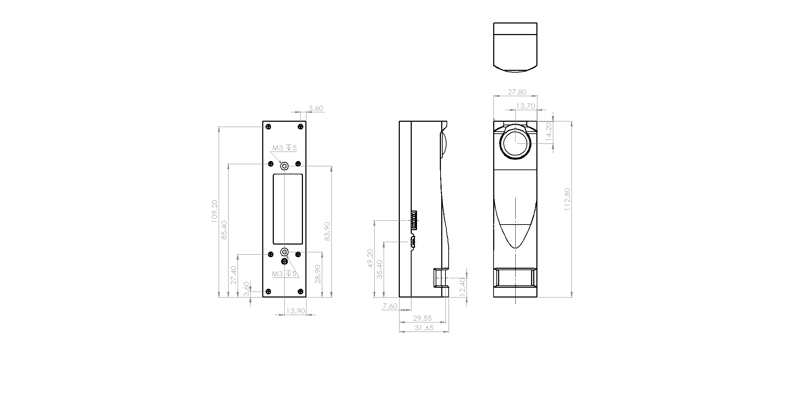
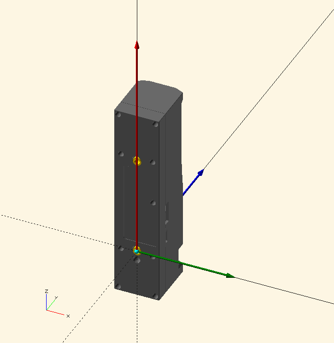

# Hardware User Interface Specification

_Rev 21 Feb 2020_

## Mechanical Interface

A mechanical envelope drawing of the enclosure is attached.
Note the mounting hole pattern on the back face of the unit, 
designed to accomodate two M3 machine screws to a depth of 5 mm,
with a spacing of 55.0 mm O.C.

These two mounting holes define the coordinate system of the data
generated by the iLidar sensor.  The iLidar sensor uses an standard 
orthogonal Cartesian coordinate system, which is positioned and 
oriented as follow:

  * The origin is at the intersection of the center line of the bottom
    mounting hole and a plane flush with the rear of the unit (note:
    this is the mounting hole closest to the rectangular laser lens).  

  * The +Z axis extends from the origin through the center of the second
    mounting hole along the rear surface of the unit.  

  * The +Y axis extends forward from the origin, in the direction of the
    laser transimission.  

  * The +X axis extends sideways from the origin, in the direction of
    the two I/O connectors.

## Electronic Interfaces

### USB Micro-B, Physical

The USB port is provided as a quick and convenient way to operate the
iLidar as a stand-alone sensor.  For example, demonstrations, field
experiments, etc.

The user can provide power to the iLidar over the USB connector J1, and
also communicate with the iLidar with USB.  The iLidar will appear on
the user's computer as a standard VCP (Virtual COM Port) asynchronous
serial port. 

The USB port is a USB 2.0, full speed device using a standard Micro-B connector.
For reference information, the USB interface IC (integrated circuit) used in
the iLidar is the CH340 by Nanjing Qinheng Microelectronics (WCH).  In
some cases, a separate driver may be required, and can be obtained on
the WCH company's [website](http://www.wch-ic.com).

### User I/O Connector, Physical

The User I/O connector is best suited for using the iLidar sensor in an
embedded module within a larger system.  This connector can be used to
power the iLidar, provides three different communication options, as
well as a trigger (input to the iLidar) and a sync (output) signal.

This connector on the iLidar, J2, is an 8-position "wafer" style connector
with male contacts, [Molex P/N 53261-0871](https://www.molex.com/molex/products/part-detail/pcb_headers/0532610871).  
The interfacing cable should have the corresponding mating connector, 
[Molex P/N 51021-0800](https://www.molex.com/molex/products/part-detail/crimp_housings/0510210800) or equivalent.
This is a crimp-style housing, and the crimp inserts are 
[Molex P/N
50079-8000](https://www.molex.com/molex/products/part-detail/crimp_terminals/0500798000),
or equivalent, which are designed to crimp onto size 0.031 ~ 0.086
square millimeter (#28 ~ #32 AWG) insulated, stranded wire, having an 
insulation diamter of 1.0 millimeters, maximum.

Pre-assembled mating cables can be obtained from various vendors instead of
making a custom cable.

#### Pinout

Below is the pinout of the User I/O connector.  This style of connectors
doesn't have a Pin 1 mark, so note that pin 1 is closest to the center
of the Ilidar sensor.  Pin 8 is closest to the USB connector.

  1.  __Vin__, 4.5 to 13 VDC 
  2.  __TXD__ `(u2s)`, SSEL `(u2s)`, SDA `(bid)`
  3.  __RXD__ `(s2u)`, SCLK `(u2s)`, SCK `(bid)`
  4.  __CTS__ `(s2u)`, MISO `(s2u)`
  5.  __RTS__ `(u2s)`, MOSI `(u2s)`
  6.  __TRIG__ `(u2s)`
  7.  __SYNC__ `(s2u)`
  8.  __GND__

  * `(u2s)` *means the signal is an input, user to sensor.*
  * `(s2u)` *means the signal is an output, sensor to user.*
  * `(bid)` *means the signal is bi-directional.*

#### Signals

There are three communications modes possible:

  * Asynchronous Serial
  * Serial Peripheral Interface (SPI)
  * Inter-Integrated Circuit (I2C)

These modes are mutually exclusive - only one can be active at a time.  
Which mode is active can be configured in the iLidar sensor's non-volatile
configuration settings.  In addition, the mode can also be selected by
external circuit connections, which will be detected by the
iLidar as power-on time as follows:

  * Default: ASYNC 2-wire (no flow control)
  * Pulldown on SYNC pin: ASYNC w/flow control
  * Pulldown on TRIG pin: SPI mode
  * Short between MISO and MOSI pins: I2C mode

